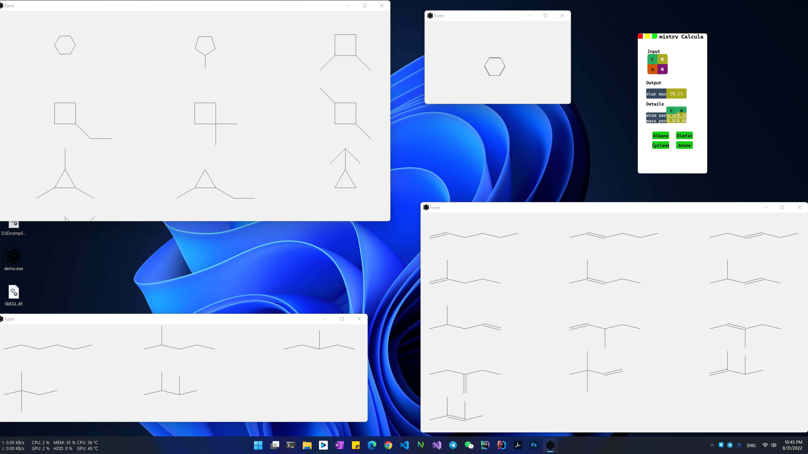

<h1 align="center">
  化学计算器(Stoichiometric)
</h1>

## 🔰 Intro

- The first project I written with my roommate(Dh.w) overnight!
- Written using qt
- Commemorative meaning is greater than the application of meaning, the code is real :shit:(look at the numerous `print` functions)

## 🦥 Funcution

- calculate the molar mass of organic matter, and its atom per atom mass per
- It can provide all the pictures for the possible solutions
  

## :pill: Usage

1. Windows: Download the release 7 zip file [:link:](https://github.com/ACupofAir/Stoichiometric/releases/tag/v1.0), and run the exe file
2. Input the `C` and `H` number in the table, then click the button on the bottom,
   then will display the result
